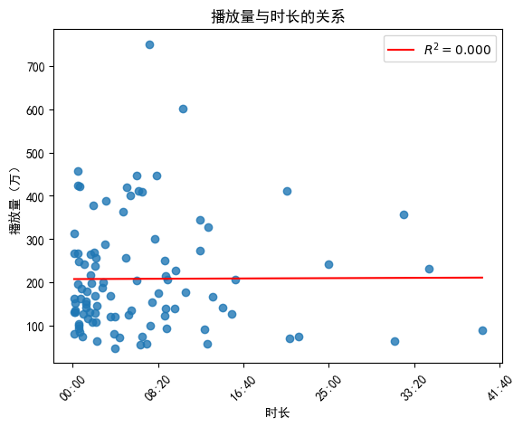
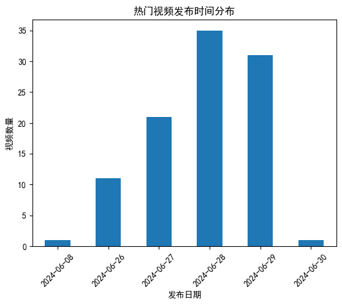
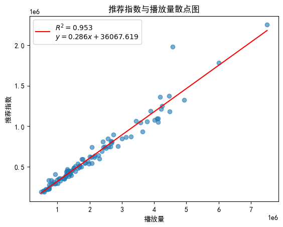
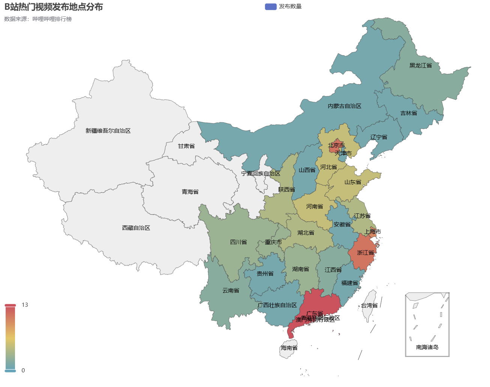
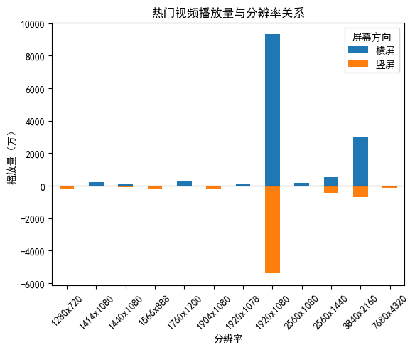
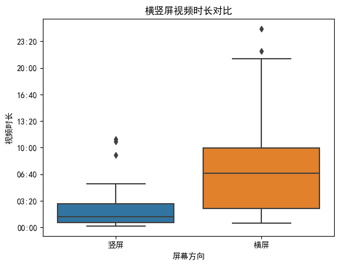
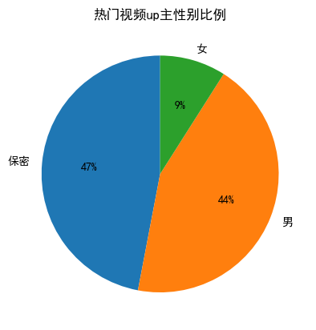
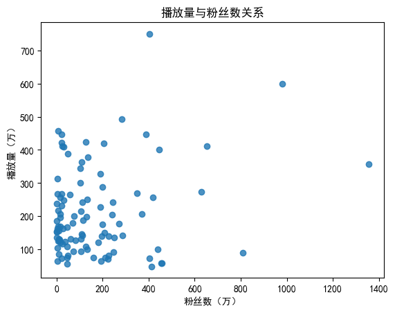

# Bilibili Rank Analysis
大数据视域下的B站视频流行趋势研究。分析[Bilibili排行榜](https://www.bilibili.com/v/popular/rank/all)视频数据，探究视频播放量与up主粉丝数的关系，视频类型、分区、地理位置分布等。包含了数据爬取、数据分析、数据可视化等完整的数据挖掘过程。


# 爬虫
[Bilibili-API](https://github.com/Nemo2011/bilibili-api)

```shell
pip install bilibili-api-python
```

# 依赖
```shell
pip install -r requirements.txt
```

# 文件说明
- `get_video_data.ipynb`: 获取Bilibili排行榜视频数据
- `get_user_data.ipynb`: 获取视频对应的up主数据
- `analysis.ipynb`: 数据分析
- `rank_data.py`: 2024年6月30日Bilibili排行榜字典数据
- `bilibili_rank.csv`: 2024年6月30日Bilibili排行榜视频数据
- `bilibili_user.csv`: 2024年6月30日Bilibili排行榜视频对应的up主数据
- `bilibili_TV.jpg`: Bilibili小电视mask

# 分析内容
以下均基于2024年6月30日Bilibili排行榜数据（共100条）。

## 视频数据
- 视频播放量与视频时长的关系

  

- 热门视频发布时间

  

- 推荐指数

  B站推荐核心算法（2021年泄露版本）：

$$\text{推荐指数}=\text{硬币}\times 0.4+\text{收藏}\times 0.3+\text{弹幕}\times 0.4+\text{播放}\times 0.25+\text{点赞}\times 0.4+\text{分享}\times 0.6$$

  

- 热门视频地理位置分布

  

- 视频分辨率分布

  

  

## up主数据
- up主性别分布

  

- 视频播放量与up主粉丝数的关系

  

## 不足
### 未分析的角度
- 热门视频类型分布
- 分区分析
- up主头衔（official title）

### 获取不到的数据
- 完播率
- 观众年龄、性别、地区分布
- 观众兴趣分布
- 播放量来源（移动端、PC、站外、h5、云视听小电视）
- 转粉分析
- 游客占比
- 粉丝观看率

### 其他
- 一个up主只能同时拥有一个热门视频，更新频繁的up主可能会将自己之前的热门视频顶掉

# 参考
- [bilibili 综合热门排行榜及数据分析](https://www.cnblogs.com/echo-1/p/15737172.html)
- [bilibili API](https://github.com/Nemo2011/bilibili-api)
- [pyecharts地区热力图](https://blog.csdn.net/qq_39451578/article/details/104372597)
- [pyecharts](https://pyecharts.org/#/zh-cn/intro)
- [python.pycharts.Map使用](https://blog.csdn.net/laoluobo76/article/details/108024560)
- [更清晰的 Python 词云 wordcloud](https://blog.csdn.net/qq_40442753/article/details/109717664.)
